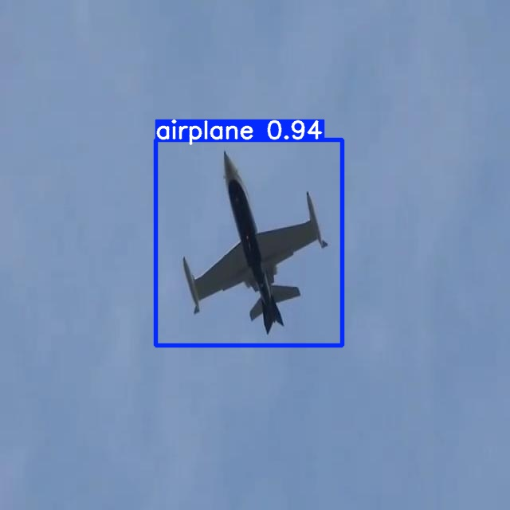

# Fine-Tuned YOLOV5 for Drone Detection

YOLOv5 🚀 is the world's most loved vision AI, representing <a href="https://www.ultralytics.com/">Ultralytics</a> open-source research into future vision AI methods, incorporating lessons learned and best practices evolved over thousands of hours of research and development.

## Project Contribution
The chosen dataset to fine-tune the model is found on [kaggle](https://www.kaggle.com/datasets/cybersimar08/drone-detection). This dataset includes various images of aerial vehicles flying. The original YOLOV5 was trained on 80 different classes of objects, hence its performance on the kaggle dataset is poor. This project focuses on specializing the original model by fine-tuning it on the kaggle dataset and including only 3 possible object classes (airplanes, drones, helicopters).

  

    
    
    
  

### Training
The model was trained with the following settings:

- batch size: 16;
- epochs: 50;
- train dataset: 10799 images;
- test dataset: 596 images;

### Validation

